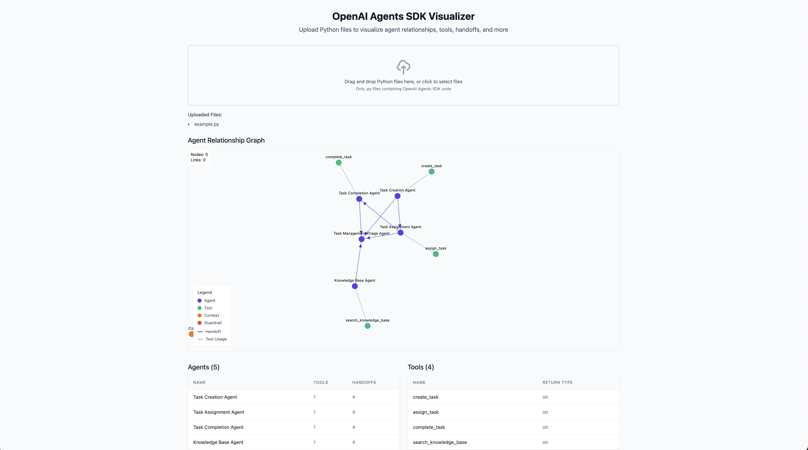

# OpenAI Agents SDK Visualizer

A visualization tool that reads OpenAI Agents SDK Python files statically and generates an interactive visualization showing the graph of agents, handoffs, guardrails, contexts, and tools.



## Features

- **Interactive Node Graph**: Displays agents as nodes with handoffs as edges between them
- **Detailed Information**: Hover over nodes and edges to see detailed information
- **File Parsing**: Statically analyzes Python files containing OpenAI Agents SDK code
- **Component Tables**: Lists all agents and tools with key information
- **Responsive Design**: Works on desktop and mobile devices

## Component Visualization

- **Agents**: Shown as indigo nodes
- **Tools**: Shown as emerald nodes
- **Contexts**: Shown as orange nodes
- **Guardrails**: Shown as red nodes
- **Handoffs**: Shown as thick blue lines with animated particles
- **Tool Usage**: Shown as thin gray lines

## Getting Started

### Prerequisites

- Node.js 16.x or later
- npm or yarn

### Installation

1. Clone the repository:
```bash
git clone https://github.com/yourusername/agent-visualizer.git
cd agent-visualizer
```

2. Install dependencies:
```bash
npm install
# or
yarn install
```

3. Start the development server:
```bash
npm run dev
# or
yarn dev
```

4. Open [http://localhost:3000](http://localhost:3000) in your browser

## Usage

1. Upload your Python files containing OpenAI Agents SDK code using the file uploader
2. The visualization will automatically parse the files and display the agent graph
3. Hover over nodes (agents, tools, etc.) to see detailed information
4. Hover over edges to see information about handoffs and tool usage
5. Use the tables below the graph to view structured information about components

## Supported OpenAI Agents SDK Patterns

- Agent definitions with name, instructions, tools, and handoffs
- Tool definitions with parameters and return types
- Context class definitions with properties
- Handoff assignments between agents
- Guardrail definitions (experimental)

## Limitations

- The parser uses regex-based pattern matching which may not catch all edge cases
- Complex Python expressions in agent definitions might not be parsed correctly
- The visualization works best with small to medium-sized agent networks (up to ~20 agents)

## Contributing

Contributions are welcome! Please feel free to submit a Pull Request.

## License

This project is licensed under the MIT License - see the LICENSE file for details.

## Acknowledgements

- [react-force-graph](https://github.com/vasturiano/react-force-graph) for the graph visualization
- [Next.js](https://nextjs.org/) for the React framework
- [Tailwind CSS](https://tailwindcss.com/) for styling
